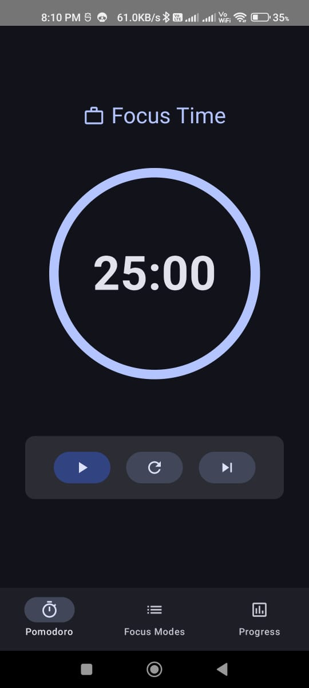
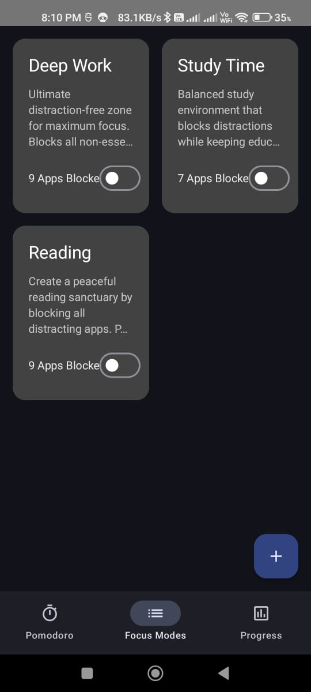
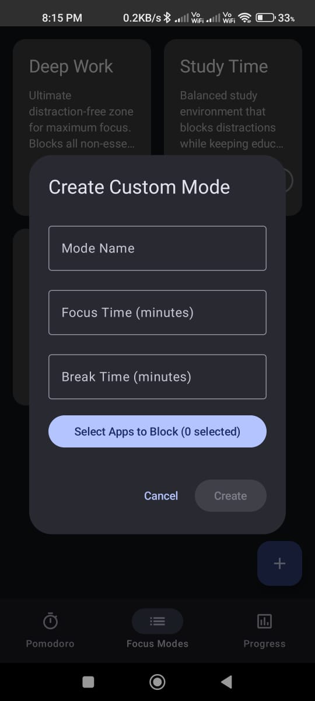
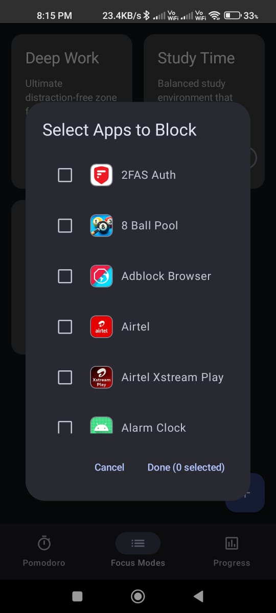
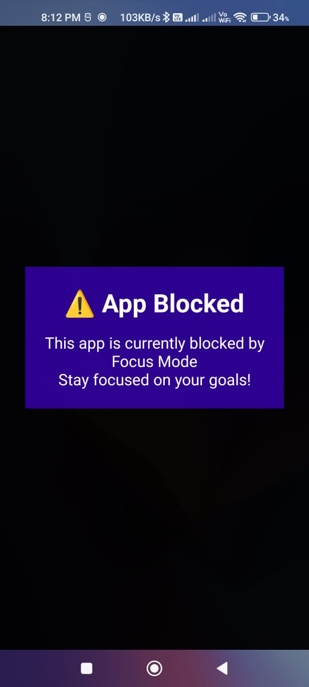
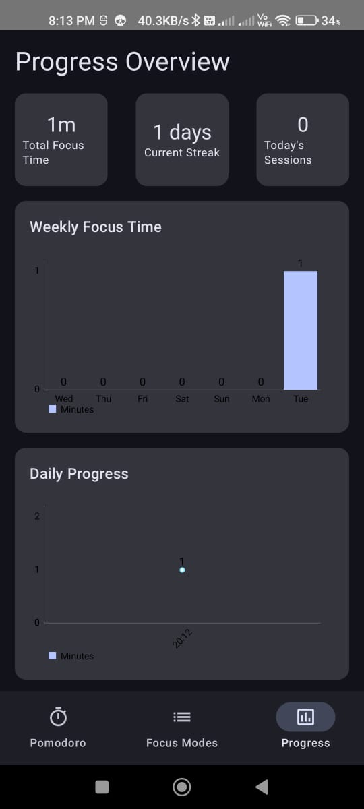

# Focus Modes App

Focus Modes App is a productivity tool that helps users stay focused on their tasks by using features like Pomodoro Timer, Distraction Blocking, Focus Modes, and Progress Tracking.

## Features

### 1. Pomodoro Timer
A customizable timer that divides work into intervals (e.g., 25 minutes of work followed by 5 minutes of break), encouraging short, focused work sessions.



---

### 2. Focus Modes
Predefined modes such as:
- **Deep Work**: Blocks all non-essential apps.
- **Study Time**: Keeps educational apps accessible.
- **Reading**: Blocks distractions for peaceful reading.
- **Custom Mode**: Users can create their own focus mode.



#### Custom Mode Creation
Create and customize focus modes by selecting specific apps to block.



#### App Selection
Select which apps to block for each mode.



---

### 3. Distraction Blocking
When a blocked app is opened, a motivational message appears instead of the app.



---

### 4. Progress Tracking
View detailed statistics and graphs showing completed Pomodoro sessions, focus times, and streaks.



---

## Installation

### Clone the Repository
1. Clone this repository:
   ``` bash
   git clone https://github.com/adnanrangrej/Focus-Modes-App.git
   ```
2. Open the project in Android Studio.
3. Build and run the app on an Android emulator or device.

## Permissions
The app requests the following permissions:
1. Display Over Other Apps (to show blocking overlay).
2. Usage Access (to detect app usage).
3. Notification Access (to block notification)

## Contributing
We welcome contributions to enhance the Focus Modes App. To contribute:
1. Fork the repository.
2. Create a new branch:
```
   git checkout -b feature-name
```
3. Make your changes and commit them:
```
git commit -m "Add feature-name"
```
4. Push your branch:
```
git push origin feature-name
```
5. Create a pull request.

## License
This project is licensed under the MIT License. See the LICENSE file for details.

## Acknowledgments
Thank you for checking out Focus Modes App! 🎉 Stay productive and focused!
